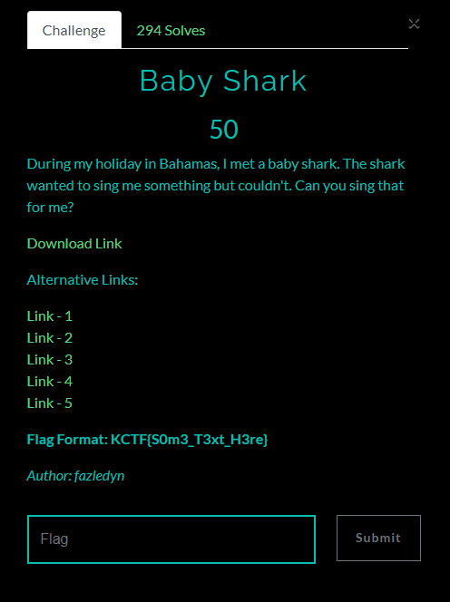
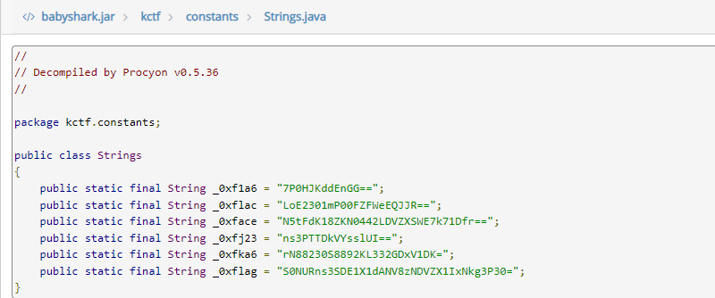

# Baby Shark

## Đề bài

  

- Bạn có thể tải file mà đề cho [tại đây](./babyshark.jar)

## Phân tích & giải
- Thử thách cho chúng ta một file Java archive data (JAR).
- Ta sẽ sử dụng tool để decompiler nó ra, ở đây ta sẽ dùng tool online [www.javadecompilers.com](http://www.javadecompilers.com/)
- Kiểm tra tất cả các file, trong đó có file String.java, ở đây có 1 biến chúng ta cần quan tâm là `_0xflag = "S0NURns3SDE1X1dANV8zNDVZX1IxNkg3P30="`, nó đang ở dạng base 64, decode nó thì ta sẽ nhận được flag

### Flag
    KCTF{7H15_W@5_345Y_R16H7?}