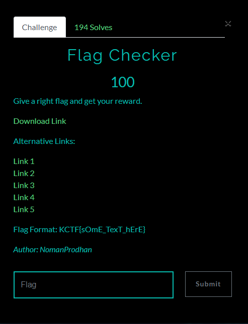
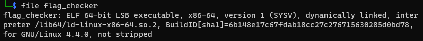
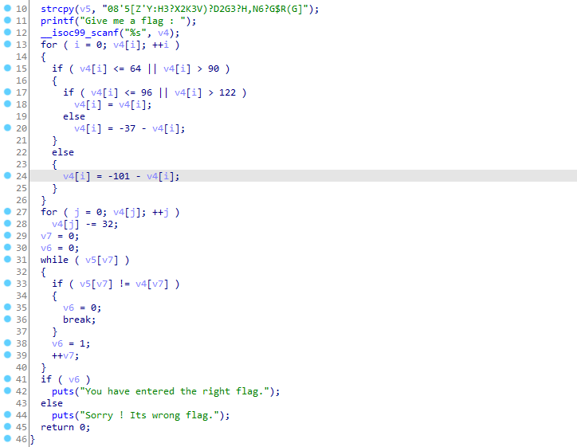

# Flag Checker

## Đề bài
<p align="center">
  
</p>

- Bạn có thể tải file mà đề cho [tại đây](./flag_checker.zip)

## Phân tích & giải

- Kiểm tra file thì ta thấy, đề cho 1 file thực thi ELF 64-bit.

- Tiếp tục dùng IDA để đọc mã giả của file thực thi, ta thấy trong hàm main, thực hiện copy chuỗi `v5 = "08'5[Z'Y:H3?X2K3V)?D2G3?H,N6?G$R(G]"`, xử lý chuỗi nhập vào v4 và kiểm tra chuỗi nhập đã được `xử lý` với chuỗi v5, nếu giống nhau thì chuỗi nhập vào chính là flag

- Do vậy chúng ta cần phải hiểu chương trình `xử lý` như thế nào!
    
    - Xử lý lần lượt qua tất cả ký tự của chuỗi nhập vào
        - nếu x là chữ cái in thường thì `x = -37-x` (a->m = n->z)
        - nếu x là chữ cái in hoa thì `x = -101-x` (A->M = N->Z)
        - sau đó `x = x - 32`
    - So sánh chuỗi nhập vào đã được xử lý với v5
- Dưới đây là đoạn code python dùng để lấy flag từ biến v5
```
v5 = "08'5[Z'Y:H3?X2K3V)?D2G3?H,N6?G$R(G]"
for x in v5:
    tmp = ord(x)+32
    if 97 <= tmp <=122:
        print(chr(256-37-tmp),end='')
    elif 65 <= tmp <=90:
        print(chr(256-101-tmp),end='')
    else:
        print(chr(tmp),end='')
```
### Flag
    KCTF{aTbAsH_cIpHeR_wItH_sOmE_tWiSt}