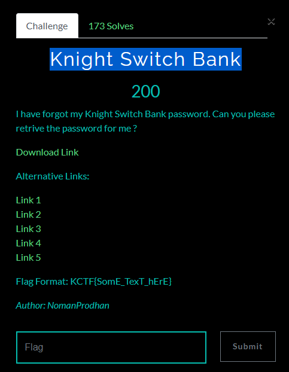
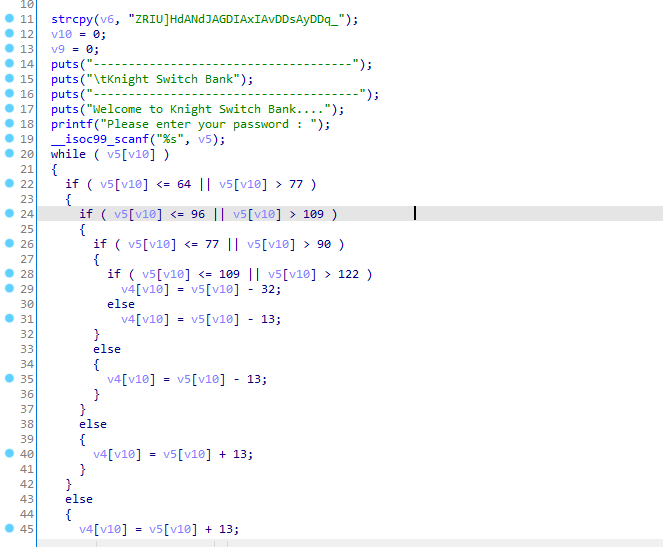

# Knight Switch Bank

## Đề bài
<p align="center">
  
</p>

- Bạn có thể tải file mà đề cho [tại đây](./ks_switch_bank.zip)

## Phân tích & giải

- Tương tự như những bài ở trên dùng IDA để đọc mã giả của file thực thi


- Dưới đây là đoạn code python dùng để lấy password
```
v6="ZRIU]HdANdJAGDIAxIAvDDsAyDDq_"

for x in v6:
    i = ord(x) - 2
    if 97 <= i <= 109:
        print(chr(i+13),end='')
    elif 110 <= i <= 122:
        print(chr(i-13),end='')
    elif 65 <= i <= 77:
        print(chr(i+13),end='')
    elif 78 <= i <= 90:
        print(chr(i-13),end='')
    else:
        print(chr(i+32),end='')
```
### Flag
    KCTF{So_YoU_ROT_iT_gOOd_jOOb}