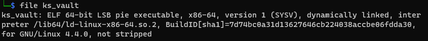

# Knight Vault

## Đề bài
<p align="center">
  
</p>

- Bạn có thể tải file mà đề cho [tại đây](./ks_vault.zip)

## Phân tích & giải

- Kiểm tra file thì ta thấy, đề cho 1 file thực thi ELF 64-bit.

- Tiếp tục dùng IDA để đọc mã giả của file thực thi, ta thấy trong hàm main, thực hiện copy chuỗi v7, xử lý chuỗi nhập vào v8 và kiểm tra chuỗi nhập đã được `xử lý` với chuỗi v7, nếu giống nhau thì chuỗi nhập vào là password

- Chuỗi v8 là một mảng ký tự có độ dài 1016, nên kí tự thứ i+512 là nửa sau của chuỗi, do vậy ta có thể hiểu là được gán cho biết tạm tmp, khi đó ta thấy rằng, chương trình duyệt qua từng ký tự
    - tmp = x - 10
    - nếu kí tự x == 'A' thì tmp = 42

- Dưới đây là đoạn code python dùng để lấy password
```
v7= "*9J<qiEUoEkU]EjUc;U]EEZU`EEXU^7fFoU^7Y*_D]s" 
for x in v7:
    i = ord(x)
    if i == 42: i=65
    print(chr(i+10),end='')
```
### Flag
    KCTF{sO_yOu_gOt_mE_gOOd_jOOb_hApPy_hAcKiNg}