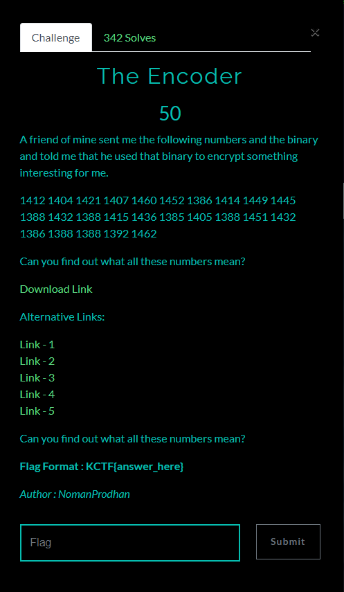
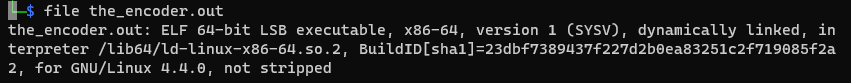
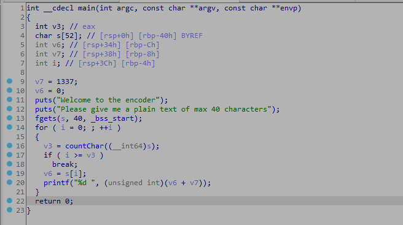

# The Encoder

## Đề bài
<p align="center">
  
</p>

- Bạn có thể tải file mà đề cho [tại đây](./the_encoder.zip)
- 1412 1404 1421 1407 1460 1452 1386 1414 1449 1445 1388 1432 1388 1415 1436 1385 1405 1388 1451 1432 1386 1388 1388 1392 1462
## Phân tích & giải

- Kiểm tra file thì ta thấy, đề cho 1 file thực thi ELF 64-bit.

- Tiếp tục dùng IDA để đọc mã giả của file thực thi

- Ta thấy chương trình đọc chuỗi từ người dùng nhập, sau đó duyệt từng ký tự của chuỗi, ép kiểu từ `char` sang `int` cộng với 1337 và in ra màng hình theo thứ tự của chuỗi ban đầu.
- Hiểu được thuật toán, nên ta sẽ viết đoạn code python để decode những số đề cho thành dạng chuỗi ban đầu
```
input_ = "1412 1404 1421 1407 1460 1452 1386 1414 1449 1445 1388 1432 1388 1415 1436 1385 1405 1388 1451 1432 1386 1388 1388 1392 1462"

def convert2char(i):
    return chr(int(i)-1337)

lst = list(map(convert2char,input_.split()))
print(''.join(lst))
```
### Flag
    KCTF{s1Mpl3_3Nc0D3r_1337}