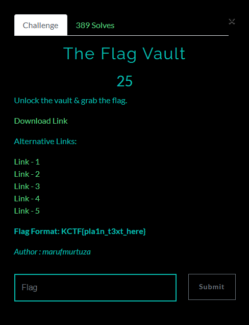
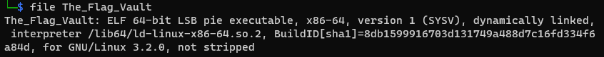
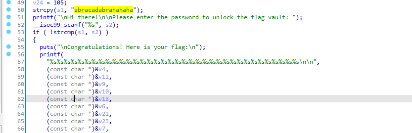
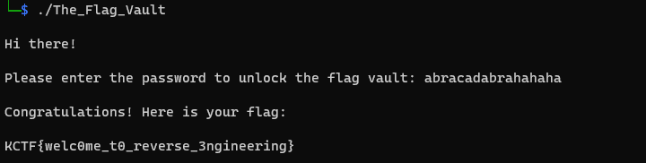

# The Flag Vault

## Đề bài

  

- Bạn có thể tải file mà đề cho [tại đây](./The_Flag_Vault.zip)

## Phân tích & giải

- Kiểm tra file thì ta thấy, đề cho 1 file thực thi ELF 64-bit.

- Tiếp tục dùng IDA để đọc mã giả của file thực thi, ta thấy trong hàm main, thực hiện copy chuỗi s1 = "abracadabrahahaha" và sau đó kiểm tra với s2 (là cái mà user nhập), nếu đúng thì in ra flag

- Do vậy nên ta sẽ chạy file và nhập chuỗi abracadabrahahaha để nhận flag

### Flag
    KCTF{welc0me_t0_reverse_3ngineering}